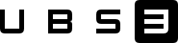

# Lichtsteuerung

  

  

Ein Projekt von Ulrich Bittner - Smart System Solutions  

Folgende Module beinhaltet das Repository Lichtsteuerung:

- __Lichtsteuerung__ ([Dokumentation](Lichtsteuerung))  
	Schaltet die Beleuchtung manuell oder automatisch ein/aus.
	