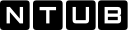

# Lichtsteuerung  

  

Ein Gemeinschaftsprojekt von Normen Thiel und Ulrich Bittner

  

Folgende Module beinhaltet das Repository `Lichtsteuerung`:

- __Lichtsteuerung__ ([Dokumentation](Lichtsteuerung))
